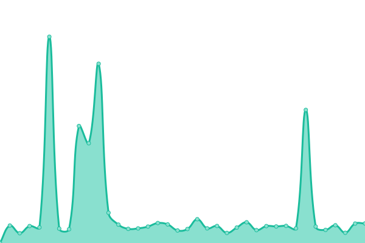
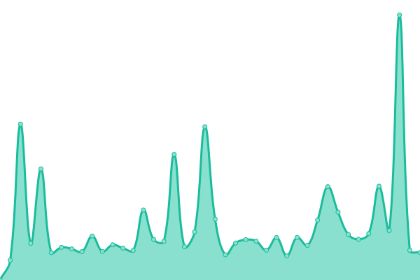

# [📈 Live Status](https://demo.upptime.js.org): <!--live status--> **🟧 Partial outage**

This repository contains the open-source uptime monitor and status page for [Aleš](https://demo.upptime.js.org), powered by [Upptime](https://github.com/upptime/upptime).

With [Upptime](https://upptime.js.org), you can get your own unlimited and free uptime monitor and status page, powered entirely by a GitHub repository. We use [Issues](https://github.com/maxXx1/uptime-status/issues) as incident reports, [Actions](https://github.com/maxXx1/uptime-status/actions) as uptime monitors, and [Pages](https://demo.upptime.js.org) for the status page.

<!--start: status pages-->
<!-- This summary is generated by Upptime (https://github.com/upptime/upptime) -->
<!-- Do not edit this manually, your changes will be overwritten -->
<!-- prettier-ignore -->
| URL | Status | History | Response Time | Uptime |
| --- | ------ | ------- | ------------- | ------ |
|  [Wildlee cloud (Brno)](wildlee.cloud) | V provozu | [wildlee-cloud-brno.yml](https://github.com/maxXx1/uptime-status/commits/HEAD/history/wildlee-cloud-brno.yml) | 

 15ms
     
 | 

<a href="https://status.pokorak.cz/history/wildlee-cloud-brno">97.69%</a>
    

|  [Hlubocky cloud (Hlubočky)](hlubocky.online) | V provozu | [hlubocky-cloud-hlubocky.yml](https://github.com/maxXx1/uptime-status/commits/HEAD/history/hlubocky-cloud-hlubocky.yml) | 

 8ms
     
 | 

<a href="https://status.pokorak.cz/history/hlubocky-cloud-hlubocky">97.69%</a>
    

|  [TeamSpeak3 server](ts.maxxx.cz) | V provozu | [team-speak3-server.yml](https://github.com/maxXx1/uptime-status/commits/HEAD/history/team-speak3-server.yml) | 

 128ms
     
 | 

<a href="https://status.pokorak.cz/history/team-speak3-server">99.37%</a>
    

|  [Herní servery](gg.maxxx.cz) | V provozu | [herni-servery.yml](https://github.com/maxXx1/uptime-status/commits/HEAD/history/herni-servery.yml) | 

 126ms
     
 | 

<a href="https://status.pokorak.cz/history/herni-servery">100.00%</a>
    

|  [f$ clan web](http://fs.clanweb.eu) | Nedostupné | [f-clan-web.yml](https://github.com/maxXx1/uptime-status/commits/HEAD/history/f-clan-web.yml) | 

 2384ms
     
 | 

<a href="https://status.pokorak.cz/history/f-clan-web">76.81%</a>
    

|  [Xfire Fórum](https://xfire.4fan.cz) | Nedostupné | [xfire-forum.yml](https://github.com/maxXx1/uptime-status/commits/HEAD/history/xfire-forum.yml) | 

 1583ms
     
 | 

<a href="https://status.pokorak.cz/history/xfire-forum">76.88%</a>
    

|  [Rohatorium festival](https://www.rohatorium.4fan.cz) | Nedostupné | [rohatorium-festival.yml](https://github.com/maxXx1/uptime-status/commits/HEAD/history/rohatorium-festival.yml) | 

 2025ms
     
 | 

<a href="https://status.pokorak.cz/history/rohatorium-festival">76.95%</a>
    

|  [Terasy Kyjov](https://terasykyjov.cz) | Nedostupné | [terasy-kyjov.yml](https://github.com/maxXx1/uptime-status/commits/HEAD/history/terasy-kyjov.yml) | 

 2152ms
     
 | 

<a href="https://status.pokorak.cz/history/terasy-kyjov">77.02%</a>
    

<!--end: status pages-->

[**Visit our status website →**](https://demo.upptime.js.org)

## 📄 License

- Powered by: [Upptime](https://github.com/upptime/upptime)
- Code: [MIT](./LICENSE) © [Anand Chowdhary](https://anandchowdhary.com), supported by [Pabio](https://pabio.com)
- Data in the `./history` directory: [Open Database License](https://opendatacommons.org/licenses/odbl/1-0/)
